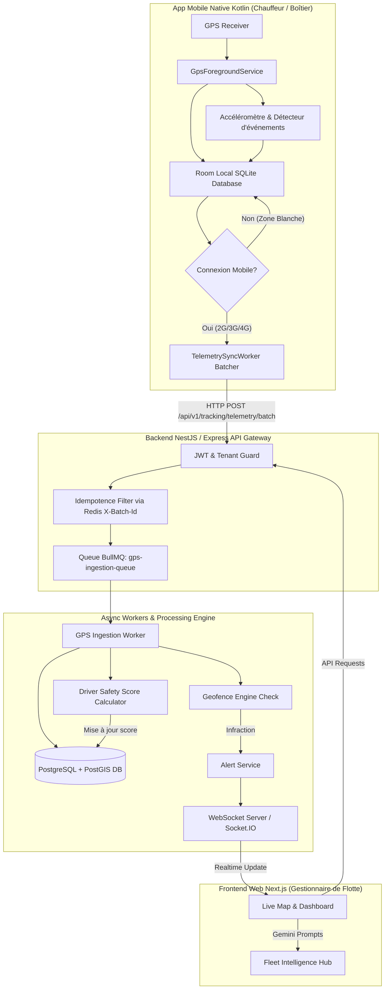

# Diagramme de flux

```mermaid
graph TD
    subgraph Mobile_Android ["App Mobile Native Kotlin (Chauffeur / Boîtier)"]
        A[GPS Receiver] --> B[GpsForegroundService]
        B --> C[Accéléromètre & Détecteur d'événements]
        B & C --> D[Room Local SQLite Database]
        D --> E{Connexion Mobile?}
        E -- "Non (Zone Blanche)" --> D
        E -- "Oui (2G/3G/4G)" --> F[TelemetrySyncWorker Batcher]
    end

    subgraph Backend_Gateway ["Backend NestJS / Express API Gateway"]
        F -->|HTTP POST /api/v1/tracking/telemetry/batch| G[JWT & Tenant Guard]
        G --> H[Idempotence Filter via Redis X-Batch-Id]
        H --> I[Queue BullMQ: gps-ingestion-queue]
    end

    subgraph Workers_Engine ["Async Workers & Processing Engine"]
        I --> J[GPS Ingestion Worker]
        J --> K[(PostgreSQL + PostGIS DB)]
        J --> L[Geofence Engine Check]
        J --> M[Driver Safety Score Calculator]
        L -- "Infraction" --> N[Alert Service]
        M -- "Mise à jour score" --> K
        N --> O[WebSocket Server / Socket.IO]
    end

    subgraph Web_Dashboard ["Frontend Web Next.js (Gestionnaire de Flotte)"]
        O -->|Realtime Update| P[Live Map & Dashboard]
        P -->|API Requests| G
        P -->|Gemini Prompts| Q[Fleet Intelligence Hub]
    end
```
